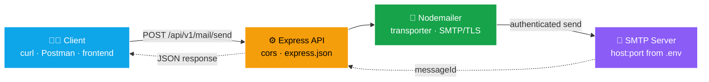
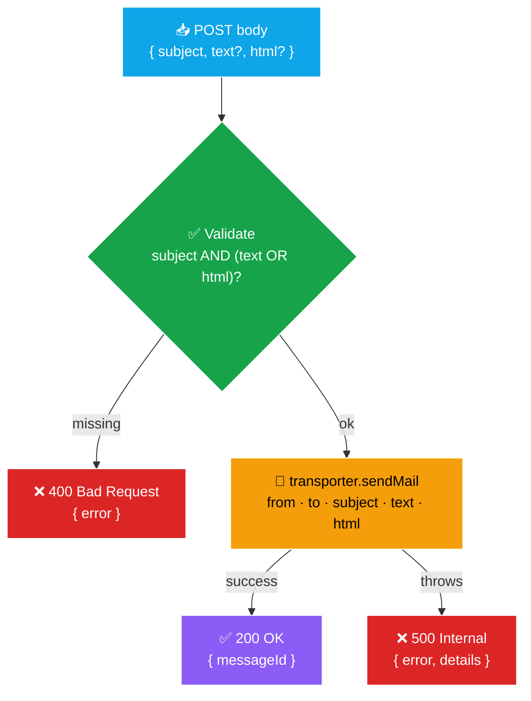

<div align="center">

# 📧 Nodemailer Example

### Minimal, Dockerized SMTP email-sending REST API in Node.js

*JSON in (`subject` + `text`/`html`), a `messageId` out. One endpoint, zero ceremony.*


**1 endpoint · 4 dependencies · SMTP/TLS · CORS-enabled · Postman collection included**

</div>

---

> **A boilerplate, not a platform.** This is a tiny REST service whose only job is to accept a
> JSON payload and relay it through *your* SMTP server using Nodemailer. No queue, no templating
> engine, no database — you bring the credentials and the recipient, it does the sending. Perfect
> as a learning reference or a drop-in starting point for adding transactional email to a stack.

## 🎯 What it is / What it's NOT

| ✅ What it **is** | ❌ What it's **NOT** |
|---|---|
| A **minimal REST API** to send email over SMTP | A full mailing/newsletter platform |
| **Dockerized & env-driven** (12-factor config) | A message **queue** or retry/scheduler |
| A **clear Nodemailer + Express** reference | An IMAP/POP **inbox** reader |
| **CORS-ready** for browser clients | An email **template** engine |

## 🗺️ Architecture



## 🔄 Request flow

Every request follows the same contract: **validate → build → send → respond**.



## 📚 API reference

### `POST /api/v1/mail/send`

Sends an email to the configured `TO_ADDRESS` through the SMTP transporter.

**Request body**

| Field | Type | Required | Description |
|---|---|---|---|
| `subject` | `string` | ✅ Yes | Email subject line |
| `text` | `string` | ⚠️ One of | Plain-text body |
| `html` | `string` | ⚠️ One of | HTML body (use either `text`, `html`, or both) |

> At least one of `text` or `html` must be present alongside `subject`.

**Responses**

| Status | Body | When |
|---|---|---|
| `200 OK` | `{ "messageId": "<...>" }` | Email accepted by the SMTP server |
| `400 Bad Request` | `{ "error": "..." }` | Missing `subject` or both bodies |
| `500 Internal` | `{ "error": "...", "details": "..." }` | SMTP / transport failure |

## ⚙️ Configuration

All configuration lives in a `.env` file (copy from [`.env.example`](.env.example)):

| Variable | Description | Example |
|---|---|---|
| `SMTP_HOST` | SMTP server hostname | `smtp.example.com` |
| `SMTP_PORT` | SMTP server port | `587` (STARTTLS) / `465` (SSL) |
| `SMTP_USER` | Account used to authenticate & as `from` | `your-email@example.com` |
| `SMTP_PASS` | Account password or app-specific password | `••••••••` |
| `TO_ADDRESS` | Recipient of every sent message | `recipient@example.com` |
| `FROM_USER_NAME` | Display name in the `From` header | `NO REPLY` |
| `PORT` | *(optional)* Express server port | `3000` (default) |

> ℹ️ The transporter ships with `secure: true`. For an SSL port like `465`, keep it; for a
> STARTTLS port like `587`, set `secure: false` (and optionally `requireTLS: true`) in
> [`index.js`](index.js).

## 🚀 Quick start

**Prerequisites:** Node.js 18+ and valid SMTP credentials.

```bash
# 1. Configure your environment
cp .env.example .env        # then edit the values

# 2. Install dependencies
npm install

# 3. Run it
npm start                   # → 🚀 API corriendo en http://localhost:3000
```

### 🐳 With Docker

```bash
docker-compose up --build   # reads .env, exposes http://localhost:3000
```

## 🧪 Try it

```bash
curl -X POST http://localhost:3000/api/v1/mail/send \
  -H "Content-Type: application/json" \
  -d '{
        "subject": "Hello from Nodemailer 👋",
        "text": "Plain-text body",
        "html": "<b>HTML body</b>"
      }'
# → { "messageId": "<unique-message-id>" }
```

A ready-to-import **Postman collection** is included at
[`Resources/NODEMAILER EXAMPLE.postman_collection.json`](Resources/NODEMAILER%20EXAMPLE.postman_collection.json).

## 🗂️ Project structure

```
nodemailer-example/
├── index.js               # Express app + Nodemailer transporter + endpoint
├── package.json           # Dependencies & start script
├── .env.example           # Environment template
├── Dockerfile             # Node 18-alpine image
├── docker-compose.yaml    # One-command run
└── Resources/
    └── NODEMAILER EXAMPLE.postman_collection.json
```

## 🧰 Tech stack

| Layer | Tool |
|---|---|
| Runtime | **Node.js 18+** |
| HTTP framework | **Express 4** |
| Email transport | **Nodemailer 6** (SMTP/TLS) |
| Config | **dotenv** |
| CORS | **cors** |
| Packaging | **Docker** + Docker Compose |

## 📄 License

No `LICENSE` file is defined yet — add one before publishing or sharing.

---

<div align="center">

Made by **[Gibran Ojeda](https://github.com/gibran-ojeda)** · `gibran.ojeda.7@gmail.com`

</div>
